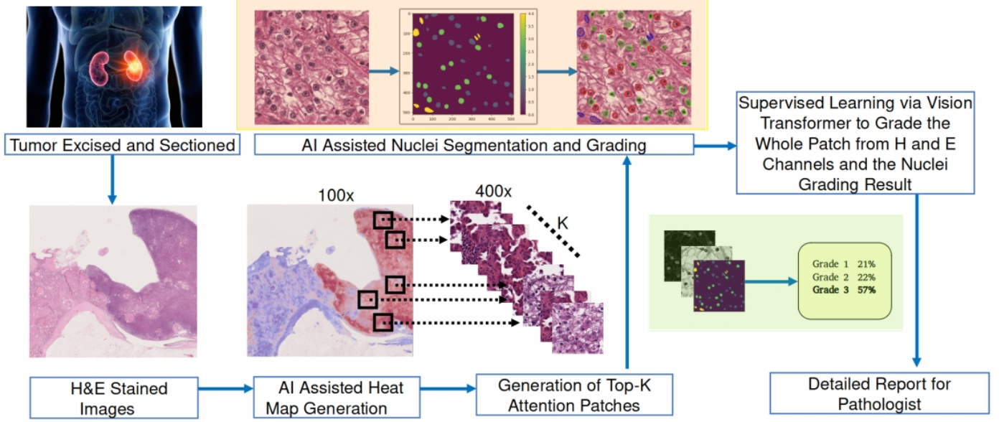
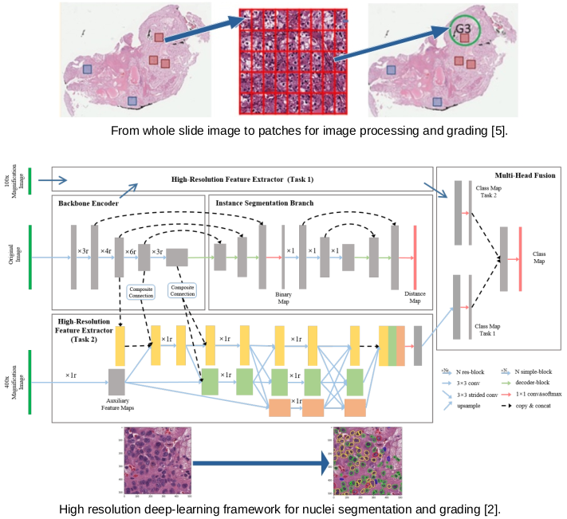
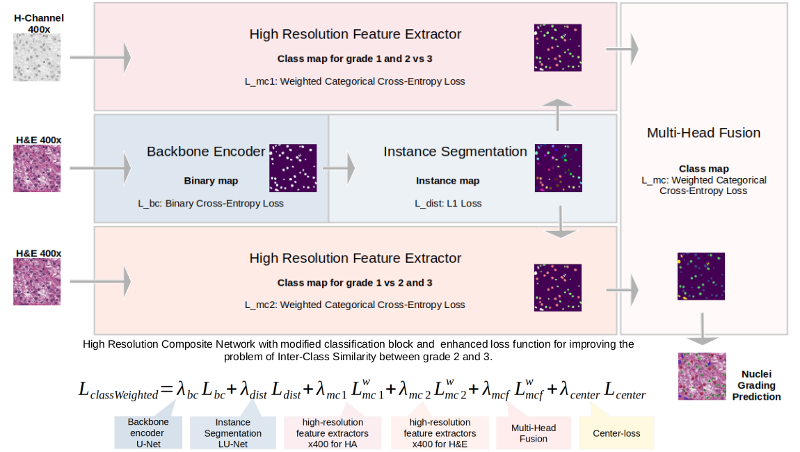
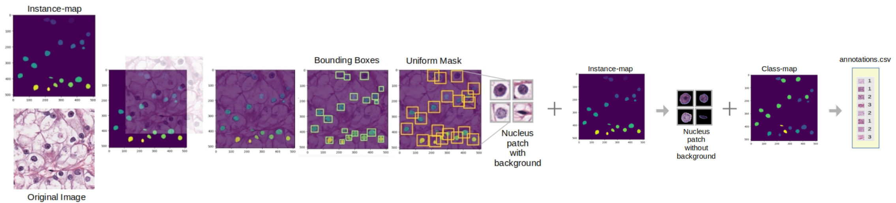
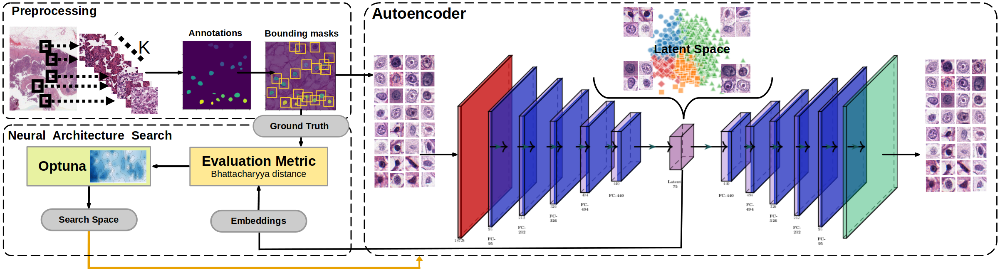
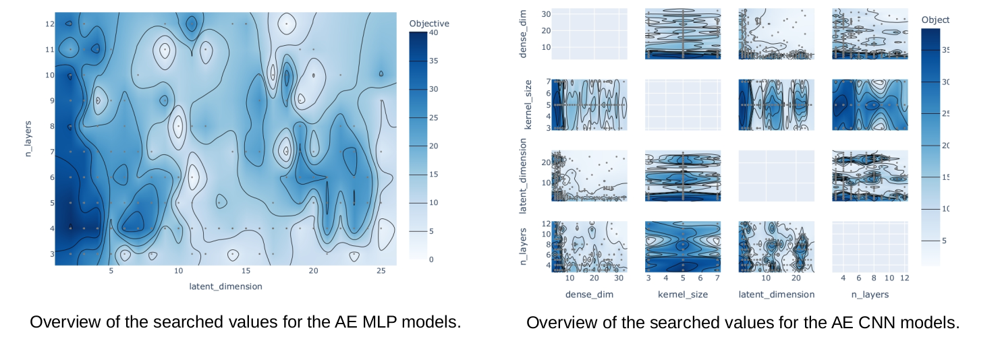
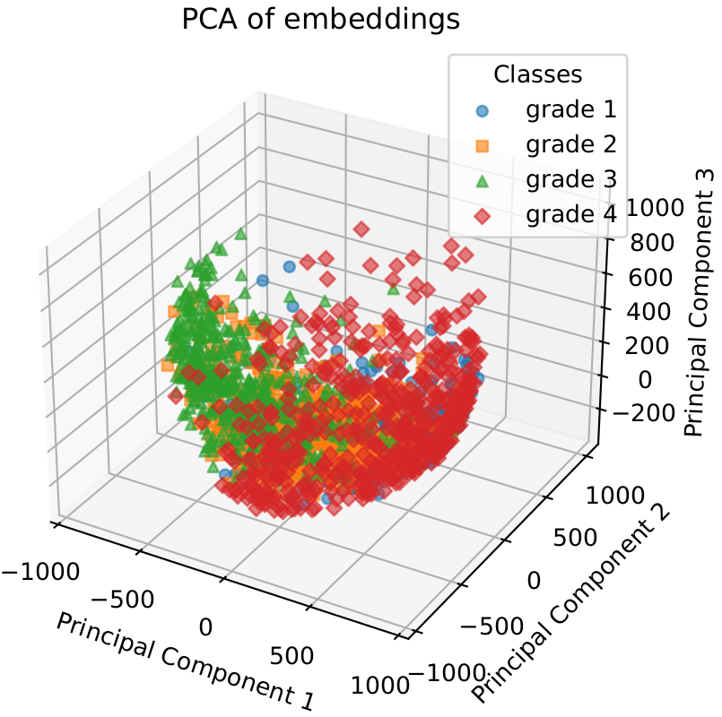
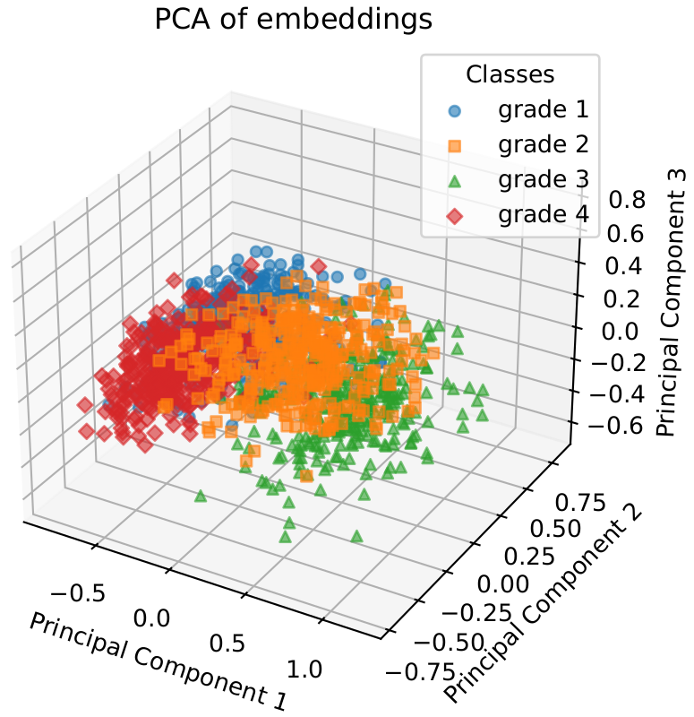
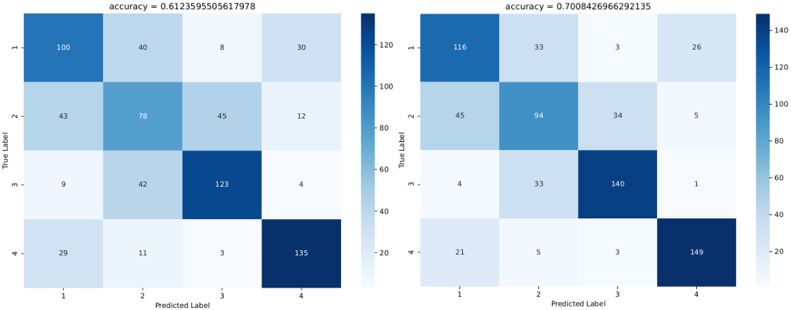
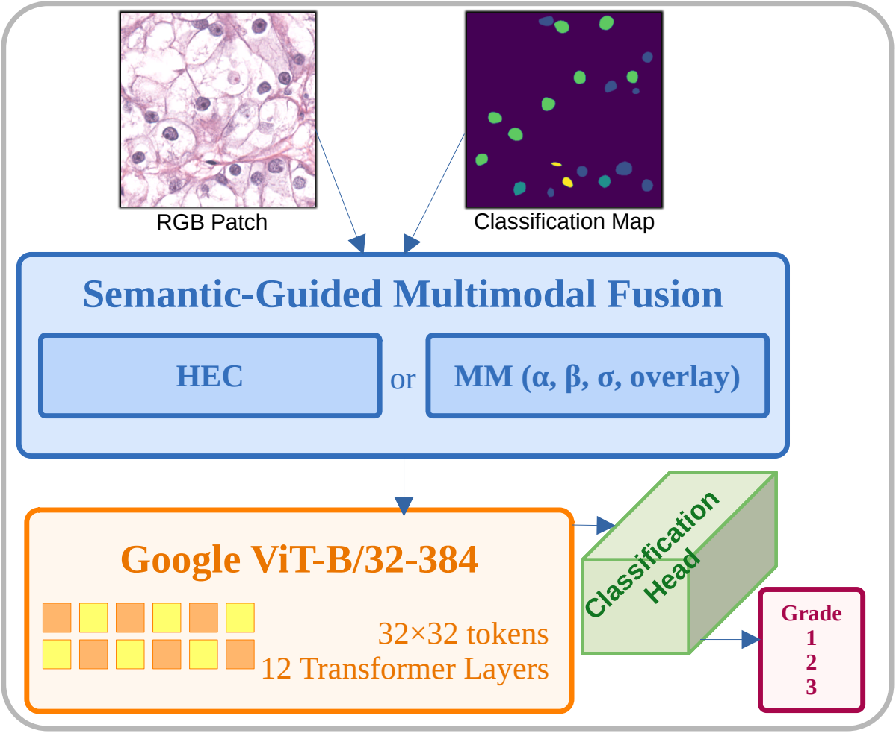

# **Meta repository:**  Deep Learning-based Grading of Cell Nuclei in Histopathological Image Data

Umbrella repository for a three-stage pipeline that grades clear cell renal cell carcinoma
(ccRCC) from H&E stained whole slide images, from individual nuclei up to the grade reported
for a whole patch. No code lives here. This repository holds the overview, the figures and the
links to the component repositories and publications.

<p align="center">
  
</p>

The pipeline starts from an excised and sectioned tumour, generates a tumour heat map over the
whole slide image, extracts the top-K attention patches at 400x magnification, segments and
grades every nucleus inside each patch, and finally grades the whole patch by combining the
nuclei classification map with the tissue image. The output is a per-patch grade distribution
for the pathologist rather than a single hard label.


## Publications

| Venue | Contribution | Stage | DOI |
| --- | --- | --- | --- |
| ICIP 2024 | Deep Learning Approach for Renal Cell Carcinoma Detection, Subtyping, and Grading | Stage 1 | [10.1109/ICIP51287.2024.10647236](https://doi.org/10.1109/ICIP51287.2024.10647236) |
| ISBI 2025 | Comparative Analysis of Unsupervised and Supervised Autoencoders for Nuclei Classification in Clear Cell Renal Cell Carcinoma Images | Stage 2 | [10.1109/ISBI60581.2025.10981207](https://doi.org/10.1109/ISBI60581.2025.10981207) |
| MICCAI COMPAYL++ 2026 | Semantic-Guided Multimodal Preprocessing for Vision Transformer-Based CCRCC Grading | Stage 3 | [10.48550/arXiv.2609.01426](https://doi.org/10.48550/arXiv.2609.01426) |

Master's thesis: *Deep Learning-based Grading of Cell Nuclei in Histopathological Image Data*.

## Repositories

| Repository | Subject |
| --- | --- |
| [`representation-learning-autoencoders`](https://github.com/javadianf/representation-learning-autoencoders) | Autoencoder representation learning for per-nucleus grading. Four variants (AE, CAE, DAE, CDAE) in MLP and CNN form, with the Optuna architecture search, the training entry points and the nuclei patch data loading. |
| [`classification-semantic-fusion-vit-HP`](https://github.com/javadianf/classification-semantic-fusion-vit-HP) | Semantic-guided preprocessing and Vision Transformer fine-tuning for whole-patch grading. HEC and multiplicative modulation, the perturbation-based sensitivity analysis and MLflow experiment tracking. |

The two repositories are independent. Each has its own environment, its own
dataset preparation and its own license, and neither imports the other. What
connects them is the data contract: the autoencoder consumes instance-masked
nuclei patches and emits a per-nucleus grade, and those grades are written back
into a class map that the transformer consumes as its semantic channel.


## Motivation

WHO/ISUP grading of ccRCC is decided by nuclear morphology, mainly by whether the nucleolus is
visible and how prominent it is. Three properties of that task drive every design decision below.

The grades that matter are the ones that are hard to tell apart. Grades 2 and 3 differ by
morphological margins narrow enough that pathologists disagree with each other on boundary cases,
and grade 3 is the one that changes treatment. Overall accuracy is a misleading target here,
because it is dominated by the easy majority class.

The data is heavily imbalanced. Grade 1 accounts for the majority of annotated nuclei and the
highest grade for under 4 percent, so an unweighted objective learns to ignore exactly the class
that carries the clinical weight.

The patch grade does not follow the nucleus counts. Max voting over per-nucleus grades reaches
only 57 percent accuracy, because a small population of high-grade nuclei can determine the grade
of the whole patch. The aggregation step has to be learned, not counted.

<p align="center">
  
</p>

The baseline for this work is the composite high-resolution network (CHR-Network) of Gao et al.,
which segments and classifies nuclei in a single model across two magnifications, trained on a
dataset of 1000 patches with 70,945 annotated nuclei.

## Stage 1: HCH-Network, nuclei segmentation and grading

The CHR-Network is extended into the H-Channel-auxiliary CHR-Network (HCH-Network) by three
changes.

An auxiliary input branch carries a gamma-modified hematoxylin channel at 400x magnification
instead of the reduced-resolution 100x RGB input of the baseline. Hematoxylin stains the nuclei
and eosin stains cytoplasm and extracellular matrix, so isolating H raises the contrast of the
nucleolus against the nuclear background. The branch is configured to separate grades 1 and 2
jointly against grade 3, which is where the baseline was weakest. Gamma values that were too low
or too saturated degraded performance, so the curve was selected by sweep rather than fixed.

A center loss term is added, minimising the squared distance between each deep feature and its
class center. This tightens intra-class variation while leaving classes separable, which is the
relevant failure mode when two grades are visually adjacent.

A class-weighted multi-class cross-entropy replaces the unweighted form, with weights set from
the data dispersion and from clinical importance: grade 1 at 1/63, grade 2 at 3 x 1/4, grade 3 at
3 x 1/9, non-tumorous at 1/23. The full objective is

```
L = λ_bc L_bc + λ_dist L_dist + λ_mc1 L_mc1 + λ_mc2 L_mc2 + λ_mcf L_mcf + λ_center L_center
```

covering the backbone U-Net encoder, the LU-Net instance segmentation, the two high-resolution
feature extractors for HA and H&E, the multi-head fusion and the center loss. All λ start at 1
in the baseline. After tuning, λ_dist and λ_mcf are raised to 2 and the rest are left at 1.

<p align="center">
  
</p>

| Source | Avg F1 | Grade 1 F1 | Grade 2 F1 | Grade 3 F1 | Mean PQ |
| --- | --- | --- | --- | --- | --- |
| CHR-Network | 0.72 | 0.82 | 0.45 | 0.52 | 0.52 |
| H-400x | 0.74 | 0.83 | 0.49 | 0.52 | 0.54 |
| Center loss | 0.72 | 0.82 | 0.49 | 0.53 | 0.53 |
| Class-weighted loss | 0.74 | 0.82 | 0.50 | 0.56 | 0.54 |
| HCH-Network | 0.74 | 0.83 | 0.54 | 0.56 | 0.55 |

Each modification helps on its own and the combination helps most, with the gain concentrated in
grades 2 and 3 exactly as intended. The backbone uses transfer learning from ImageNet-pretrained
ResNet34.

Unannotated slides from public databases were also graded and reviewed with pathologists.
Tumorous regions were marked at 100x, the preprocessing module generated 512x512 patches at 400x,
and the predictions were inspected by eye. This form of validation does not scale, so it was used
as a sample check rather than as a metric.

## Stage 2: classifier-driven autoencoder for per-nucleus grading

Repository: [`representation-learning-autoencoders`](https://github.com/javadianf/representation-learning-autoencoders).
Paper: [ISBI 2025](https://doi.org/10.1109/ISBI60581.2025.10981207).

### Data preparation

Every nucleus is cropped into its own background-free patch, so the model judges it on intrinsic
shape and texture rather than on its neighbours.

<p align="center">
  
</p>

The instance map assigns a unique identifier to every nucleus, which is what makes it possible to
separate nuclei inside a cluster where a class map alone would merge them. Bounding boxes are
computed across all nuclei and the largest uniform square is taken so every patch has the same
size, each nucleus is centered in its mask, and the patch is named after the source image plus
the instance index so it can be mapped back to its position in the slide. The grade is read from
the class map into a CSV table. A binary mask dilated by 3 pixels is then applied per colour
channel to remove the background and suppress adjacent nuclei.

Final patch size is 3 x 79 x 79, 6941 patches in total: 3782 grade 1, 752 grade 2, 850 grade 3,
1557 non-tumorous. Training uses a balanced subset.

Removing the background is a deliberate deviation from most of the literature. It forces the
network onto the nucleus interior, where the grading criterion lives, at the cost of all
information about nuclear distribution and neighbourhood, which is part of what a pathologist
uses.

### Models and search

<p align="center">
  
</p>

Four autoencoder types, each in an MLP and a CNN form. **AE** reconstructs only. **CAE** adds the
squared Frobenius norm of the encoder Jacobian, penalising latent sensitivity to small input
changes. **DAE** adds a term acting directly on class geometry in the latent space. **CDAE** adds
a supervised classification branch on top of the latent vector.

Architecture and hyperparameters are searched with Optuna, backed by a SQL trial store, with a
funnel constraint forcing encoder widths to decrease monotonically. The objective is the
Bhattacharyya distance between per-class distributions in the latent space, not reconstruction
error, because reconstruction quality says nothing about grade separation. Davies-Bouldin,
Calinski-Harabasz, Silhouette and MANOVA were considered and set aside: the first three treat
cohesion and dispersion as independent and therefore misread latent spaces that are tightly
clustered but poorly separated, and MANOVA assumes a normality that latent spaces do not provide.
KL divergence was rejected for asymmetry.

<p align="center">
  
</p>

Bhattacharyya distance of the best model of each type. Higher means better separated classes.

| Model | AE | CAE | DAE | CDAE |
| --- | --- | --- | --- | --- |
| MLP | 14.75 | 24.50 | 17.43 | 34.62 |
| CNN | 16.33 | 19.21 | 25.93 | 47.23 |

Reconstruction alone does not recover the grade structure. The plain autoencoder gives the
weakest separation in both forms, which is the expected result rather than a tuning failure:
pixel-level variance is driven by nucleus size and stain intensity, not by nucleolar prominence.

<p align="center">
  
  
</p>

First three PCA components of the latent space. Left: plain AE. Right: CDAE-CNN. Grade 4 in the
legend denotes non-tumorous cells, not WHO/ISUP grade 4. Supervision, not architecture, is what
reorganises the space: adding the classification branch raises the CNN Bhattacharyya distance
from 25.93 to 47.23, a larger jump than any change of encoder type produced. Grade boundaries in
ccRCC are partly conventional, set by expert agreement on how prominent a nucleolus has to be,
and there is no reason an unsupervised objective would place its decision surface where the WHO
convention places it.

### Objective choice is itself a result

Once the CDAE-CNN structure was fixed, the search was rerun against F1.

| Metric | Bhattacharyya optimised | F1 optimised |
| --- | --- | --- |
| Overall precision | 0.6104 | 0.6985 |
| Overall recall | 0.6111 | 0.7008 |
| Overall F1 | 0.6113 | 0.6994 |
| Grade 1 F1 | 0.5571 | 0.6373 |
| Grade 2 F1 | 0.4469 | 0.5481 |
| Grade 3 F1 | 0.6890 | 0.7821 |
| Non-tumorous F1 | 0.7520 | 0.8300 |
| Bhattacharyya distance | 47.23 | 36.90 |

<p align="center">
  
</p>

Confusion matrices for the CDAE-CNN found by Optuna under the two objectives. Left is the
Bhattacharyya-optimised model at 0.6124 accuracy, right the F1-optimised model at 0.7008. The
model with the best separated latent space is not the best classifier. A well separated latent
space is a proxy for good classification, and these numbers put a size on how far the proxy
diverges from the target. For a search costing hundreds of trials, that is not a detail.

Against the CHR-Network trained on the same source data, the CDAE loses on grade 1 and wins on
everything else, including grade 3 F1 of 0.7821 against 0.5228, and balanced accuracy of 0.7008
against 0.6405. That trade goes the right way for this task, since grade 1 is the most common
class and the least consequential for the final grade. The result also comes with handicaps: the
CDAE trained on a balanced subset and therefore saw far fewer nuclei, and background removal
discards the spatial context the CHR-Network can use.

## Stage 3: Vision Transformer for whole-patch grading

Repository: [`classification-semantic-fusion-vit-HP`](https://github.com/javadianf/classification-semantic-fusion-vit-HP).
Paper: [MICCAI COMPAYL++ 2026](https://doi.org/10.48550/arXiv.2609.01426).

Fine-grained nuclei classifiers and coarse-grained patch classifiers stay isolated in the
literature. Fine-grained methods collapse per-nucleus predictions into a patch grade by max
voting, which assigns the most abundant class and therefore under-grades any patch whose
significance comes from a sparse high-grade population. Coarse-grained methods send the RGB patch
into a transformer and never use the nuclei-level knowledge that pretrained nuclei classifiers
already encode. This stage takes a third route: fuse the nuclei classification map into the RGB
patch as a preprocessing step, before the image reaches the network, so a stock pretrained ViT
learns the relation between nuclear grade distribution, spatial context and patch grade with no
architectural change.

<p align="center">
  
</p>

Two fusion methods are implemented. **HEC** applies colour deconvolution, keeps the hematoxylin
and eosin channels, discards the third deconvolution channel (a cross product of the stain
vectors, carrying no independent stain information) and puts the classification map in its place,
mapped linearly onto the full 8-bit range. **MM** leaves RGB intact and modulates it
multiplicatively by nuclei grade importance, with a sigmoid grade weighting, Gaussian smoothing
of the classification channel, and an optional perceptually optimised colour overlay. The
multiplicative form scales the image gradient rather than replacing it, so the texture that ViT
attention keys on survives the fusion.

The backbone is Google ViT-B/32-384, pretrained on ImageNet-21k, selected over four alternatives
by fine-tuning all of them on RGB only under an identical protocol.

| Method | Bal. Acc. | Accuracy | F1 |
| --- | --- | --- | --- |
| Max voting over nuclei grades | 0.427 | | |
| Original RGB baseline | 0.7071 | 0.7723 | 0.7611 |
| HEC | 0.8612 | 0.8911 | 0.8859 |
| MM, best configuration | **0.9160** | 0.9208 | 0.9220 |

Three findings carry the stage. The colour overlay, not the intensity modulation, carries the
discriminative signal: configurations with overlay disabled fall to 0.7889 and 0.7703 despite
having the most aggressive modulation strengths in the sweep. Stronger modulation is not better
modulation, and a badly tuned configuration drops below the RGB-only baseline, which is evidence
the model is using the semantic content rather than treating it as noise. And the gain survives
realistic upstream error: with segmentation and classification errors injected into the
classification maps at evaluation time, the fusion stays above the RGB-only baseline out to 60
percent perturbation and degrades monotonically rather than collapsing. Current nuclei
classifiers sit at roughly 0.64 to 0.70 balanced accuracy, so the method does not require a
better nuclei model than the ones that already exist.

## End-to-end result

The transformer doubles as a shared yardstick for the two nuclei-level models, since its input
class map is produced by them and its output therefore depends on their quality. For the CDAE,
which classifies cropped patches rather than emitting a map, the class map is rebuilt by writing
each predicted grade back onto the non-zero pixels of the corresponding instance in the instance
map.

Nuclei grading, F1 per class:

| Model | Grade 1 | Grade 2 | Grade 3 | Endo | Overall |
| --- | --- | --- | --- | --- | --- |
| CHR-Network | 0.82 | 0.45 | 0.52 | 0.69 | 0.72 |
| HCH-Network | 0.83 | 0.55 | 0.59 | 0.69 | 0.74 |
| CDAE CNN | 0.80 | 0.63 | 0.69 | 0.66 | 0.72 |

Whole-patch grading, using each model's class map as the semantic channel:

| Source of class map | F1 | Accuracy | Precision | Recall |
| --- | --- | --- | --- | --- |
| Ground truth | 0.80 | 0.80 | 0.81 | 0.80 |
| CHR-Network | 0.66 | 0.63 | 0.75 | 0.59 |
| HCH-Network | 0.69 | 0.68 | 0.75 | 0.63 |
| CDAE CNN | 0.78 | 0.70 | 0.78 | 0.69 |

Improvements at the nucleus level propagate to the patch level. Moving from the baseline class
map to the CDAE map raises patch-level F1 from 0.66 to 0.78, close to the 0.80 obtained with
ground-truth annotations. The CDAE reaches this while being the weakest of the three on grade 1
and while working from background-free patches, which confirms that the gain comes from the
grades that decide the patch rather than from the majority class.

## Data

All work uses H&E stained ccRCC images from the TCGA Research Network, with nuclei annotations
from Gao et al. Whole-patch grades for stage 3 were annotated by pathologists following WHO/ISUP
guidelines for grades 1 to 3. Grade 4, denoting sarcomatoid or rhabdoid dedifferentiation, is
excluded because its nuclei no longer follow a consistent pattern. Neither the images nor the
annotations are redistributed in any of these repositories.

Single-pathologist annotation for the patch grades means inter-observer variability is not
captured. The claim being tested at stage 3 is the methodological advantage of semantic-guided
preprocessing, not clinical-grade ground truth.

## References

1. M. Rabjerg, O. Gerke, B. Engvad, N. Marcussen. Comparing World Health Organization /
   International Society of Urological Pathology grading and Fuhrman grading with the prognostic
   value of nuclear area in patients with renal cell carcinoma. Uro 1(1), 2-13 (2021).
2. Z. Gao et al. Nuclei grading of clear cell renal cell carcinoma in histopathological image by
   composite high resolution network. MICCAI 2021, LNCS 12908, 132-142.
3. V. F. Muglia, A. Prando. Renal cell carcinoma: histological classification and correlation
   with imaging findings. Radiologia Brasileira 48(3), 166-174 (2015).
4. Z. Gao et al. Instance-based Vision Transformer for subtyping of papillary renal cell
   carcinoma in histopathological image. MICCAI 2021, LNCS 12908.
5. K. Tian, C. A. Rubadue, D. I. Lin, M. Veta, M. E. Pyle, H. Irshad, Y. J. Heng. Automated clear
   cell renal carcinoma grade classification with prognostic significance. PLoS One 14(10),
   e0222641 (2019).
6. S. Rifai, P. Vincent, X. Muller, X. Glorot, Y. Bengio. Contractive auto-encoders: explicit
   invariance during feature extraction. ICML 2011, 833-840.
7. A. Dosovitskiy et al. An image is worth 16x16 words: transformers for image recognition at
   scale. arXiv:2010.11929 (2020).
8. G. Hu et al. From WSI-level to patch-level: structure prior-guided binuclear cell fine-grained
   detection. Medical Image Analysis 89, 102931 (2023).
9. J. Nyman et al. Spatially aware deep learning reveals tumor heterogeneity patterns that encode
   distinct kidney cancer states. Cell Reports Medicine 4(9), 101189 (2023).
10. A. C. Ruifrok, D. A. Johnston. Quantification of histochemical staining by color
    deconvolution. Analytical and Quantitative Cytology and Histology 23(4), 291-299 (2001).
11. T. Akiba, S. Sano, T. Yanase, T. Ohta, M. Koyama. Optuna: a next-generation hyperparameter
    optimization framework. KDD 2019.
12. A. Bhattacharyya. On a measure of divergence between two statistical populations defined by
    their probability distributions. Bulletin of the Calcutta Mathematical Society 35, 99-110
    (1943).
13. K. He, X. Zhang, S. Ren, J. Sun. Deep residual learning for image recognition. CVPR 2016.
14. K. H. Brodersen, C. S. Ong, K. E. Stephan, J. M. Buhmann. The balanced accuracy and its
    posterior distribution. ICPR 2010, 3121-3124.

Full reference lists are in the individual repositories and in the thesis.

## Citation

```bibtex
@INPROCEEDINGS{10981207,
  author={Javadian, Fatemeh and Aminparast, Zahra and Stegmaier, Johannes and Jose, Abin},
  booktitle={2025 IEEE 22nd International Symposium on Biomedical Imaging (ISBI)}, 
  title={Comparative Analysis of Unsupervised and Supervised Autoencoders for Nuclei Classification in Clear Cell Renal Cell Carcinoma Images}, 
  year={2025},
  volume={},
  number={},
  pages={1-5},
  keywords={Visualization;Accuracy;Microprocessors;Autoencoders;Supervised learning;Computer architecture;Neural architecture search;Tuning;Standards;Tumors;Contractive Autoencoder;Classifier Discriminative Autoencoder;Hyperparameter Optimization;Nuclei Grading;Optuna;Fine-grained Classification;Neural Architecture Search},
  doi={10.1109/ISBI60581.2025.10981207}}

```

## License

The text and figures in this repository are released under `ADD_LICENSE`. The component
repositories carry their own licenses: AGPL-3.0-or-later for the autoencoder repository and MIT
for the Vision Transformer repository.
